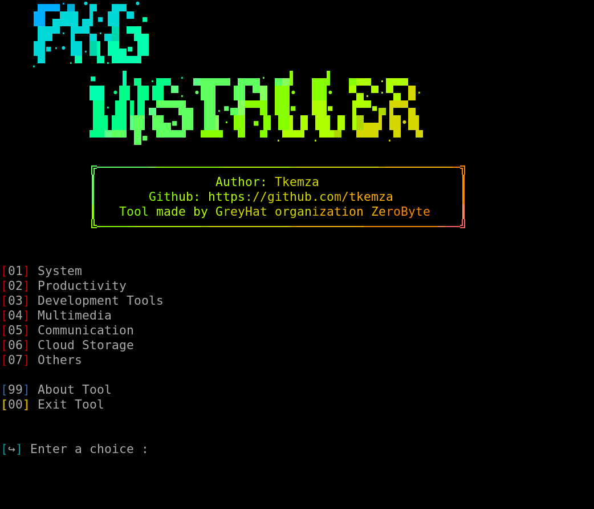

# ABOUT

**Tool Name  :   `pkgi` - simple package installer**

**Tool made for new Linux users for practical work and installation of pkgs and their includes**

-----
# REQUIREMENTS

~ `Git`

-----
# CLONING

~ To `clone` this `ripository`, simply type:

    git clone https://github.com/tkemza/pkgi.git

-----
# USAGE

~ All instructions are given on the terminal

~ Simply enter a digit beside your request directory and click `ENTER` 

~ Same goes for everything

~ To go into `pkgi` directory, type:

    cd pkgi

~ End than you can type `chmod +x pkgi.sh` to give sudo permissions to the bash file and then:

    bash pkgi.sh

-----
# PREVIEW

~ Here is a preview of tool:

-----
# IMPORTANT

~ If you have any issue while running or using this tool, conctact me at:

    tkemaz.git@proton.me

~ Any issues will be fixed in upcoming `version 2.0`

-----
# MIT LICENSE

`MIT LICENSE` (c) 2024 `tkemza`

